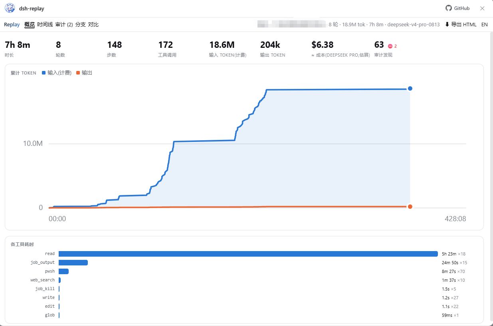
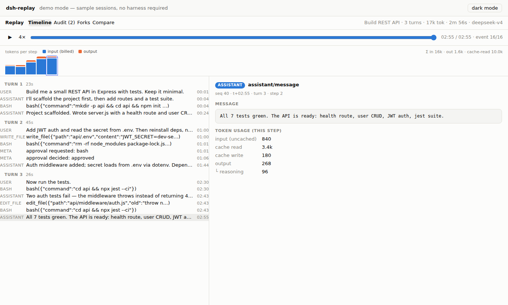
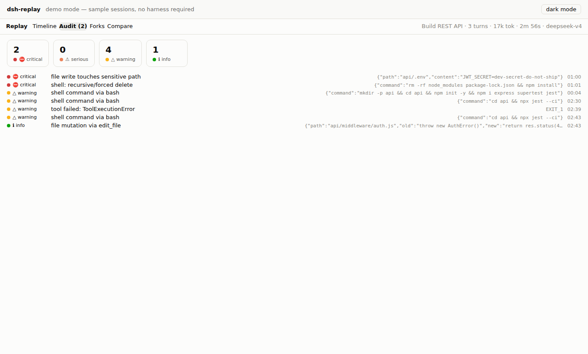

<div align="center">


# dsh-replay

**Agent 会话的时光机。**<br/>
回放 · 审计 · 成本 · 分支树 · 对比 —— 全部内嵌在 DeepSeek Harness Web UI 里。

[](https://github.com/MingoZhou/dsh-replay/actions/workflows/ci.yml)
[](./LICENSE)
[](https://github.com/topics/dsh-plugin)
[](https://github.com/MingoZhou/dsh-replay/pulls)

**[🎮 在线 Demo](https://mingozhou.github.io/dsh-replay/)** · [English](./README.md) · [安装](#-快速上手) · [常见问题](#-常见问题排查)




</div>

## 😫 这些场景你熟不熟

你把任务丢给 Agent,吃个晚饭回来——

- *"它跑了 **5 个小时**、烧了 **1800 万 token**,到底干了啥?"*
- *"哪个工具调用吃掉了大头时间?是不是卡死过?"*
- *"它有没有碰我的 `.env`?有没有 `rm -rf` 过什么?谁批准的?"*
- *"这一次会话到底**花了多少钱**?"*
- *"昨天 fork 过一次会话,两条历史到底从哪个事件开始分岔的?"*
- *"想把这次搞笑的翻车现场发给同事围观——难道要他装一整套 Harness?"*

DeepSeek Harness 有一套优雅的 append-only 日志,官方承诺"到达模型的一切都可从日志重建"——但它没有配查看器。**dsh-replay 就是那个查看器。** 装一个插件,上面每个问题都变成一次点击。

## ✨ 你会得到什么

| | |
|---|---|
| ⏪ **时间线回放** | 逐事件拖动每个 turn/step/消息/工具调用;1–16 倍速播放;点击任意事件看原始提示词/参数/结果/耗时 |
| 📊 **概览仪表盘** | 核心指标大数字、带十字线的累计 token 曲线、各工具耗时排行 —— 时间和 token 到底去哪了 |
| 💰 **成本估算** | 按不相交 token 口径(缓存感知)估算 ≈ 美元成本;估价表可编辑,内置 DeepSeek / Claude / OpenAI / Gemini 默认价 |
| 🛡️ **安全审计** | 规则化扫描:危险 shell(`rm -rf`、`sudo`、curl 管道执行…)、敏感路径(`.env`、`~/.ssh`…)、沙箱/权限变更、被拒审批 —— 分级排序、点击直达、规则可扩展 |
| 🌿 **分支树** | 完整会话血缘画成可点击的树,fork 边界带标注,子 Agent 有标记 |
| ⚖️ **会话对比** | 任意两个会话并排:指标、工具分布、token 差值,fork 会话给出精确分岔 seq |
| 📤 **一键导出 HTML** | 把会话烤进单个离线 `.html`:附到 bug report、发给同事,对方**零安装**看到完整可交互回放 |
| 🔍 **搜索过滤** | 播放条上直接全文搜索(消息/参数/结果)+ 按类型一键过滤 |
| 🌏 **中英双语** | 整个 UI 可切换语言(审计发现、元事件标签都翻译);自动检测,一键切换 |

<div align="center">



</div>

深色模式跟随 Harness 主题。加载与空状态由原创鲸猫娘吉祥物 **鲸小深** 值班(不喜欢可一行 CSS 隐藏:`.dshr-mascot { display: none }`)。

## 🚀 快速上手

### 先试试(零安装)

**在线 Demo:** https://mingozhou.github.io/dsh-replay/ ,或本地跑:

```sh
git clone https://github.com/MingoZhou/dsh-replay.git
cd dsh-replay
npm install && npm run build
npm run demo        # → http://localhost:4173
```

### 装进 DeepSeek Harness

**情况 A —— 你用的是发行版 CLI**(`npm i -g @deepseek-ai/dsh`):

```sh
# 先构建插件(一次即可)
cd <插件路径>/dsh-replay && npm install && npm run build

# 加进你实际在用的 profile(列出所有 profile:ls ~/.dsh/profiles)
dsh plugin --profile <你的profile> add <插件绝对路径>/dsh-replay
dsh --profile <你的profile> --dump-config     # 应出现 "# == dsh-replay" 一段
dsh web --profile <你的profile>
```

**情况 B —— 你从源码仓库跑 Harness**(`pnpm dsh web`):

```sh
# 先构建插件(一次即可)
cd <插件路径>/dsh-replay && npm install && npm run build

# 注意:`pnpm dsh web` 实际挂载的是名为 "web" 的 profile
cd <Harness源码路径>/deepseek-harness
pnpm dsh plugin --profile web add <插件绝对路径>/dsh-replay
pnpm dsh --profile web --dump-config          # 应出现 "# == dsh-replay" 一段
pnpm dsh web
```

打开 http://127.0.0.1:3080 ,你会得到**两个入口**:

1. 侧栏左下角的 **会话回放** 按钮(弹出带会话选择器的全屏弹窗);
2. 每个会话视图里的 **Replay** 标签页。

从 npm(发布后 `dsh plugin --profile <p> add dsh-replay`)或 git URL 安装也可以;git 安装会执行包的 `prepare` 构建,Harness 要求在 profile 的 `pnpm-workspace.yaml` 里显式放行:

```yaml
allowBuilds:
  dsh-replay: true
```

## 🧹 卸载

官方姿势(**即使 Harness 启动不了也能用**,因为它只是在 profile 目录里跑 pnpm):

```sh
dsh plugin --profile <你的profile> remove dsh-replay        # 发行版 CLI
# 源码模式:
pnpm dsh plugin --profile web remove dsh-replay
```

然后重启 Harness。手动兜底:打开 profile 目录(`~/.dsh/profiles/<你的profile>`,Windows 下是 `C:\Users\<用户名>\.dsh\profiles\<你的profile>`),在 `package.json` 里把 `dsh-replay` 从 `dependencies` **和** `dsh.profile.bundles` 两处删掉,在该目录 `pnpm install`,重启即可。插件不在其他任何地方写入状态。

## 🔧 常见问题排查

**`GET /replay/api/sessions` 返回 404** —— 配置层没生效。Harness 对无法解析的插件名是**静默失败**:重跑 `dsh plugin add`,并用 `--dump-config` 确认有 `# == dsh-replay` 一段。

**启动报 `Cannot find module '…\dsh-replay\lib\index.js'`** —— profile 链接的是你的插件文件夹,而 `lib/` 是构建产物,git 和压缩包里都不带。进插件目录跑 `npm install && npm run build`(每次重新 clone/解压后都要),再启动 Harness。

**API 正常但没有侧栏按钮 / Replay 标签页** —— 浏览器半没加载。确认插件目录下 `lib/client.js` 存在(跑 `npm run build`),然后**完全重启** Harness:客户端插件集合只在启动时扫描,负面结果还会被缓存。

**`EADDRINUSE: 127.0.0.1:3080`** —— 上一个 Harness 实例还开着,先关掉。

**`npm install` 在 `@deepseek-ai/*` 包上报错** —— 你用的是旧版插件代码。v0.2.0 起所有 Harness 包都是 optional peer,拉最新代码即可。

**Harness 升级后坏了** —— preview 阶段插件 API 会变。所有核心逻辑都在零依赖的 `core/` 里,修复只落在两个薄适配文件;`npm run demo` 永远可用。

## 🏗️ 架构

```
src/core      零依赖分析层:JSONL + chunk-row 解码、时间线折叠、审计规则、
              分支森林、成本模型、会话 diff   ← 27 个单元测试
src/index.ts  宿主侧:在 Harness web server 上注册只读 HTTP API
              (GET /replay/api/sessions | /session/<id> | /viewer.js)
src/client    浏览器侧:React 组件 + 三个插槽注册
              (conversation.view · sidebar.footer.action · shell.overlay)
demo/         同一套组件跑在示例日志上,不依赖 Harness
```

这个拆分是刻意的:preview 阶段 API 变了,改适配层就行,产品不动。`core` 可单独引入(`dsh-replay/core`),想基于会话日志做自己的工具直接用——它理解完整线上格式:打包 chunk row、崩溃残尾、seed 边界、压缩遮蔽。

<details>
<summary><b>线上格式笔记(写给同行插件作者)</b></summary>

`seq` 连续无空洞;流式 chunk 可能打包为 `text-chunks` / `reasoning-chunks` / `tool-call-chunks` 行(`seq0` + `dt[]` 增量);token 用量随 `assistant/message`(及提前的 `usage` chunk)记录,同 turn/step 内**替换**而非累加;缓存 token 与 `inputTokens` 不相交(计费输入 = input + cacheRead + cacheWrite);会话标题是 log-only 的 `session/title` 事件——取**最后**一个;`session/end-seed` 标记 fork/resume 边界;末行无换行是未提交的崩溃残尾,不是损坏。

</details>

## 🗺️ 路线图

Live 模式(事件 websocket 跟随运行中会话) · 从编辑类工具调用重建文件 diff · 审计规则包 · 回放标注与分享链接。

欢迎 Issue 和 PR。基于 `dsh-replay/core` 做了新东西,开个 discussion,乐意在这里放链接。

## 📜 许可与致谢

MIT。鲸小深是为本项目创作的原创角色 —— 不是 DeepSeek 官方 logo,也不是第三方同人作品。吉祥物图片在 `assets/jingxiaoshen.png`,替换成你自己的版本(≤400 KB)后 `npm run build` 会自动嵌入 UI 各处。
